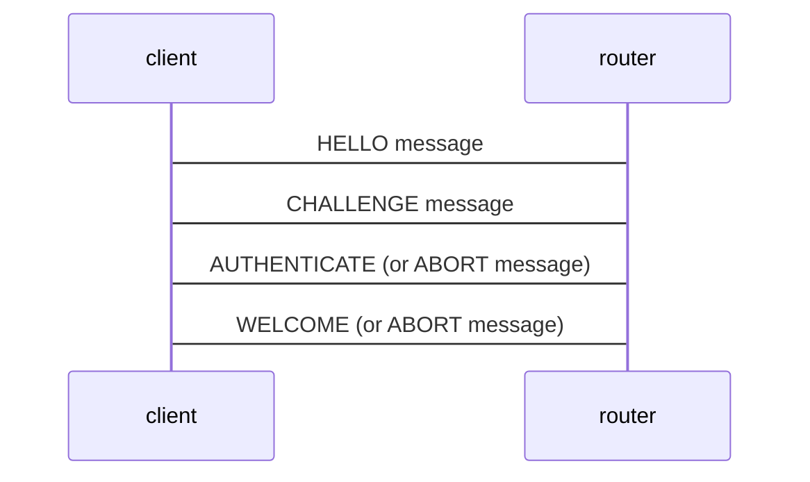

# wamp_client

> This library wraps an existing (incomplete) WAMP client implementation and adds some required features. It is a first approach for a WAMP client implementation in Erlang.


## Handler API
The handler API follows the WAMP APIs.

All callbacks should have at least two arguments (`KWArgs` and `Opts`):

```erlang
-type callback  ::  {module(), FunctionName :: atom()}
    | function(
        (KWArgs :: map(), Opts :: map()) ->
            wamp_return() | wamp_error();
        (Arg1 :: any(), ..., ArgN :: any(), KWArgs :: map(), Opts :: map()) ->
            wamp_return() | wamp_error()
    )
```

Return types:
```erlang
-type wamp_result() ::  {
    ok,
    Args :: list(),
    KWArgs :: map(),
    Details :: map()
}.

-type wamp_error()  ::  {
    error,
    Uri :: binary(),
    Args :: list(),
    KWArgs :: map(),
    Details :: map()
}.
```

## Configuration

### Authentication



The following auth methods are supported (See below an example of the auth configuration):
- `password`: Password authentication in WAMP involves the use of a username and password. This method is straightforward and relies on the client providing a password that matches the one stored on the server. It’s similar to traditional login methods used in many web applications. The password is send in clear-text and is therefore vulnerable to password “sniffing” attacks, unless the connection is protected by TLS encryption. It should be avoided and replaced by the use of wamp-cra or wamp-scram challenge-response methods if possible.
- `wampcra`: WAMP-CRA (WAMP Challenge-Response Authentication) is a more secure method compared to plain password authentication. Here’s how it works:
  - The client sends a “hello” message to the server.
  - The server responds with a challenge, a unique string.
  - The client then uses a secret (shared between the client and the server) and the challenge to generate a hashed response.
  - The server verifies this response using the same secret and challenge. If it matches, the client is authenticated.
  
  WAMP-CRA ensures that passwords are not sent over the network, reducing the risk of interception.
- `crytosign`: it requires **libsodium**!! WAMP-Cryptosign is a WAMP-level authentication mechanism which uses Curve25519-based cryptography - Ed25519 private signing keys. It allows authentication from both sides (client-router and router-client) to prevent MITM attacks. Like TLS, it is a public-key authentication mechanism. In this method:
  - The client and server both have key pairs (public and private keys).
  - The client signs authentication messages with its private key.
  - The server verifies the signature using the client’s public key.
  - This method provides a very high level of security since it relies on the robustness of cryptographic algorithms and ensures that private keys never need to be transmitted or shared.

  Cryptosign is especially useful in scenarios requiring strong security assurances and is well-suited for environments where public-key infrastructures (PKIs) are used.

These methods cater to different security needs and levels, allowing flexibility in choosing the right one for a given application’s security requirements.

### Type Spec and structure

```erlang
{wamp_client, [
    {routers, Routers :: map(Name :: atom() => Router :: router())},
    {defaults, #{
        router => RouterName :: atom(),
        caller => #{
            features => caller_features(),
            options => caller_options()
        },
        callee => #{
            features => caller_features(),
            options => caller_options()
        },
        subscriber => #{
            features => caller_features(),
            options => caller_options()
        },
        publisher => #{
            features => caller_features(),
            options => caller_options()
        }
    }},
    {peers, #{
        PeerName :: atom() => Peer :: peer()
    }}
]}
```

#### Peer
```erlang
#{
    router => RouterName :: atom(),
    pool_size => integer(),
    pool_type => hash | round_robin |direct | random,
    roles => #{
        caller => #{},
        publisher => #{},
        callee => #{
            features => #{},
            registrations => #{URI :: binary() => registration()}
        },
        callee => #{
            features => #{},
            subscriptions => #{URI :: binary() => subscription()}
        }
    }
```

### Complete example
```erlang
[
    %% service conf
    {wamp_client, [
        {routers, #{
            bondy => #{
                hostname => "localhost",
                port => 18082,
                realm => <<"com.leapsight.test">>,
                encoding => json,
                reconnect => true,
                reconnect_max_retries => 10,
                reconnect_backoff_min => 500,
                reconnect_backoff_max => 120000,
                reconnect_backoff_type => jitter,
                auth => #{
                    user => <<"john.doe">>,
                    %% anonymous (default) | password | wampcra | cryptosign
                    method => wampcra,
                    secret => <<"123456">>,
                    pubkey => <<"1766c9e6ec7d7b354fd7a2e4542753a23cae0b901228305621e5b8713299ccdd">>,
                    privkey => <<"4ffddd896a530ce5ee8c86b83b0d31835490a97a9cd718cb2f09c9fd31c4a7d71766c9e6ec7d7b354fd7a2e4542753a23cae0b901228305621e5b8713299ccdd">>
                }
            }
        }},
        {defaults, #{
            router => bondy,
            caller => #{
                features => #{
                    progressive_call_results => false,
                    progressive_calls => false,
                    call_timeout => true,
                    call_canceling => false,
                    caller_identification=> true,
                    call_retries => true
                },
                options => #{
                    timeout => 15000,
                    disclose_me => true
                }
            },
            callee => #{
                features => #{
                    progressive_call_results => false,
                    progressive_calls => false,
                    call_timeout => true,
                    call_canceling => false,
                    caller_identification => true,
                    call_trustlevels => true,
                    registration_revocation => true,
                    session_meta_api => true,
                    pattern_based_registration => true,
                    shared_registration => true,
                    sharded_registration => true
                },
                options => #{
                    disclose_caller => true,
                    invoke => roundrobin
                }
            },
            publisher => #{
                features => #{
                    message_retention => true,
                    publisher_exclusion => true,
                    publisher_identification => true,
                    subscriber_blackwhite_listing => true
                }
            },
            subscriber => #{
                features => #{
                    event_history => false,
                    pattern_based_subscription => true,
                    publication_trustlevels => true,
                    publisher_identification => true,
                    sharded_subscription => true
                }
            }
        }},
        {peers, #{
            default => #{
                router => bondy,
                pool_size => 3,
                pool_type => hash,
                roles => #{
                    caller => #{},
                    publisher => #{},
                    callee => #{
                        features => #{},
                        registrations => #{
                            <<"com.example.add2">> => #{
                                options => #{
                                    disclose_caller => true,
                                    invoke => roundrobin
                                },
                                handler => {wamp_client_example, add}
                            },
                            <<"com.example.echo">> =>#{
                                handler => {wamp_client_example, echo}
                            },
                            <<"com.example.multiple">> =>#{
                                handler => {wamp_client_example, multiple_results}
                            },
                            <<"com.example.circular">> =>#{
                                handler => {wamp_client_example, circular}
                            },
                            <<"com.example.circular_service_error">> =>#{
                                handler => {wamp_client_example, circular_service_error}
                            },
                            <<"com.example.unknown_error">> =>#{
                                handler => {wamp_client_example, unknown_error}
                            },
                            <<"com.example.notfound_error">> =>#{
                                handler => {wamp_client_example, notfound_error}
                            },
                            <<"com.example.validation_error">> =>#{
                                handler => {wamp_client_example, validation_error}
                            },
                            <<"com.example.service_error">> =>#{
                                handler => {wamp_client_example, service_error}
                            },
                            <<"com.example.authorization_error">> =>#{
                                handler => {wamp_client_example, authorization_error}
                            },
                            <<"com.example.timeout">> =>#{
                                handler => {wamp_client_example, timeout}
                            }
                        }
                    },
                    subscriber => #{
                        features => #{},
                        subscriptions => #{
                            <<"com.example.onhello">> =>#{
                                handler => {wamp_client_example, onhello}
                            },
                            <<"com.example.onadd">> => #{
                                handler => {wamp_client_example, onadd}
                            }
                        }
                    }
                }
            }
        }}
    ]},

    {awre, [
        {erlbin_number, 15},
        {agent, my_service}
    ]},

    {kernel, [
        {logger, [
          {handler, default, logger_std_h,
            #{formatter => {log_formatter, #{single_line => true, depth => 10 }}}
          }
        ]},
        {logger_level, info}
    ]}
].
```


